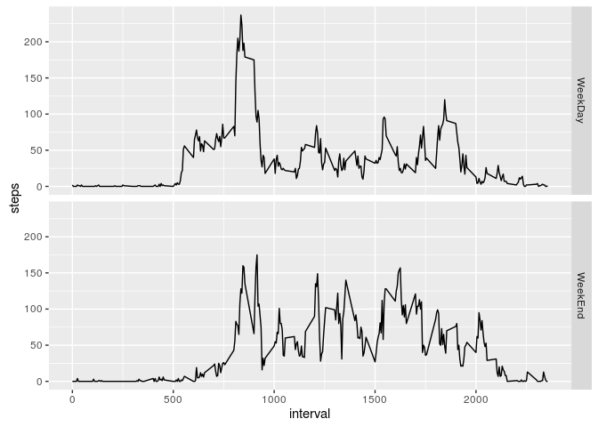

# Reproducible Research: Peer Assessment 1


## Loading and preprocessing the data
When we load the data the date will be is string format which needs to be converted to date.

```r
data <- read.table(unz("activity.zip", "activity.csv"), header=T, quote="\"", sep=",",stringsAsFactors = F)
data$date <- as.Date(data$date, format = "%Y-%m-%d")
str(data)
```

```
## 'data.frame':	17568 obs. of  3 variables:
##  $ steps   : int  NA NA NA NA NA NA NA NA NA NA ...
##  $ date    : Date, format: "2012-10-01" "2012-10-01" ...
##  $ interval: int  0 5 10 15 20 25 30 35 40 45 ...
```


## What is mean total number of steps taken per day?
I'll be using the tapply function on steps along with date to sum up the steps in a day to get steps per day. As there are NA values for steps i'll be using the na.rm on sum to skip the NA values.

```r
steps_per_day <- tapply(data$steps, data$date, sum, na.rm = T)
hist(steps_per_day, xlab = "Total Steps Per Day", main = "Histogram of Total number of steps per day")
```

<!-- -->

And then calculate the mean/average number of steps and use the formatC function to make the number easyly readable.

```r
mean_steps_per_day <- formatC(round(mean(steps_per_day)), format="d", big.mark=',')
```
The mean Total number of steps taken per day is 9,354 Steps


## What is the average daily activity pattern?

```r
average_steps_per_interval <- tapply(data$steps, data$interval, mean, na.rm = T)
plot(names(average_steps_per_interval), average_steps_per_interval, type = "l", xlab = "Interval", ylab = "Average Steps per Intervals")
```

<!-- -->

```r
average_max_steps_taken <- which.max(average_steps_per_interval)
time_mas_average_steps <- format(as.numeric(names(average_max_steps_taken)), big.interval = 2L, big.mark = ":", width = 4, justify = "right")
```
The index 104 or interval 835 or at time  8:35 is when the maximum number of steps were taken


## Imputing missing values
Calculating missing values

```r
missing_value_count <- sum(is.na(data$steps))
```
The Total Number of missing values for steps in the data set are 2304

To populate these missing values i'll be calculating the mean/average steps taken on the basis for day of the week and the interval. And populate this that to the respective missing steps data

```r
data$day <- as.factor(weekdays(data$date))
missing_steps <- round(tapply(data$steps, paste(data$day ,"-", data$interval) ,mean, na.rm = T))
data$steps[is.na(data$steps)] <- missing_steps[paste(data$day[is.na(data$steps)], "-", data$interval[is.na(data$steps)])]
```
Now that the missins fields have been populated we can create the histogram

```r
new_steps_per_day <- tapply(data$steps, data$date, sum, na.rm = T)
hist(new_steps_per_day, xlab = "Total Steps Per Day", main = "Histogram of Total number of steps per day")
```

<!-- -->

```r
new_mean_steps_per_day <- formatC(round(mean(new_steps_per_day)), format="d", big.mark=',')
new_median_steps_per_day <- formatC(median(new_steps_per_day), format="d", big.mark=',')
```
The mean of steps taken per day is 10,821 and the median is 11,015

## Are there differences in activity patterns between weekdays and weekends?
We'll now split the days as weekday and weekend and calculate the mean/average steps taken at each interval

```r
data$day_type <- as.character(data$day %in% c("Saturday", "Sunday"))
data$day_type[data$day_type == "TRUE"] = "WeekEnd" 
data$day_type[data$day_type == "FALSE"] = "WeekDay" 

temp_day_type_steps <- round(tapply(data$steps, paste(data$day_type ,"-", data$interval) ,mean, na.rm = T))
t<-seq(0,2355,by=5)
t<-t[t %in% data$interval]
week_day_steps <- temp_day_type_steps[paste("WeekDay", "-", t)]
week_end_steps <- temp_day_type_steps[paste("WeekEnd", "-", t)]
```
Ploting the graph

```r
library(ggplot2)
final_df <- rbind(data.frame(steps = week_day_steps, interval = t, day_type=rep("WeekDay", length(week_day_steps))), data.frame(steps = week_end_steps, interval = t, day_type=rep("WeekEnd", length(week_end_steps))))
qplot(interval,steps, data=final_df, facets = day_type~., geom="line")
```

<!-- -->

